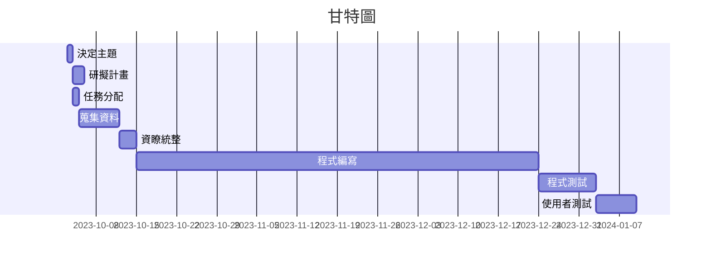
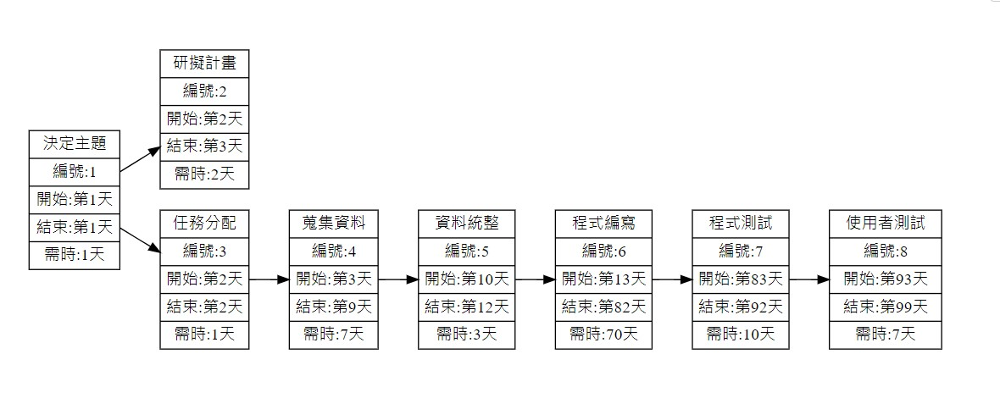
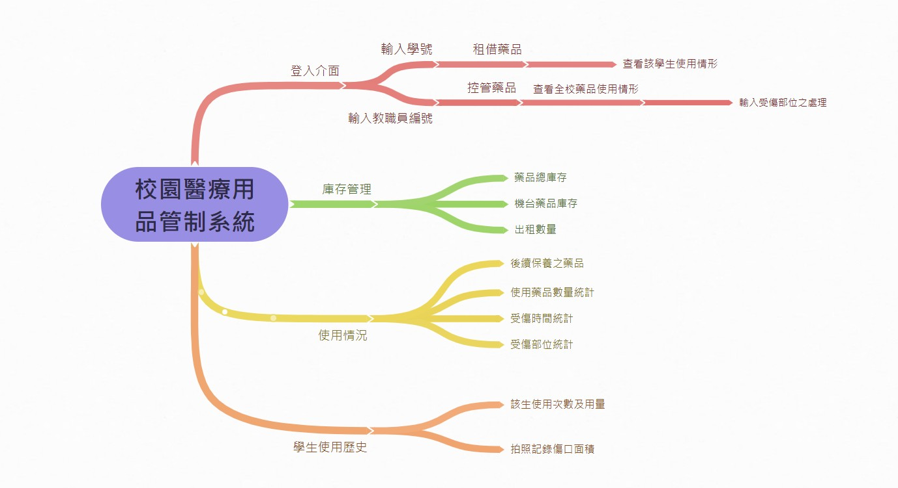
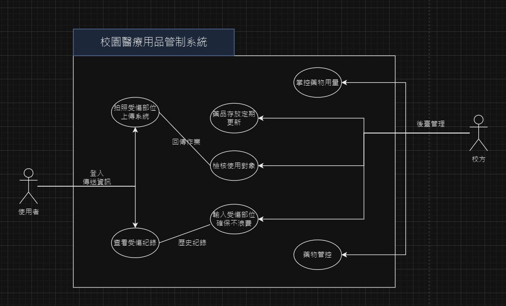

# 第六組
## 題目：校園醫療用品管制系統
### 專題簡介：
高科大的衛生保健組有一個嚴重的問題，因為地緣關係，只能將衛保組坐落在學校的最深處–行政大樓（A棟），導致學生在受傷時不能及時受到救護，若在學校的每一棟樓設置一個簡易的醫療用品租借櫃，讓學生掃描QRcode登記使用，並記錄使用用途，操作完畢後即可獲得相應的救護方式，讓學生自己能夠及時進行救治，並透過系統產生出學生所受傷害後續救護，讓學生在受傷過後能夠進行正確的救護，此外可以透過系統後台看到醫療用品的使用紀錄以及學生的醫療情形，有效對醫療用品進行管理，若租借櫃的醫療用品已將所剩無幾，便可立即進行補充。
因為租借櫃採用學生學號做為登記依據，學生若惡意搜刮醫療用品，系統會將該學生設為黑名單，禁止該學生的學號進行租借兩個月，可以讓藥品給真正需要的人而不是被濫用。
### 分工表
|  *編號*  |  *任務內容*  |  *所需時(天)*  |  *前置任務*  |  *負責人*  |
| :------: |   :------:  |    :------:   |   :------:  |  :------:  |
|     1    |   決定主題   |       1       |      /      |張絜雅、康悅菱、李宜珃、夏嘉敏|
|     2    |   研擬計畫   |       2       |      1      |張絜雅、康悅菱、李宜珃、夏嘉敏|
|     3    |   任務分配   |       1       |      1      |張絜雅、康悅菱、李宜珃、夏嘉敏|
|     4    |   蒐集資料   |       7       |      3      |張絜雅、康悅菱、李宜珃、夏嘉敏|
|     5    |   資料統整   |       3       |      4      |張絜雅、康悅菱、李宜珃、夏嘉敏|
|     6    |   程式編寫   |       70      |      5      |張絜雅、康悅菱、李宜珃、夏嘉敏|
|     7    |   程式測試   |       10      |      6      |張絜雅、康悅菱、李宜珃、夏嘉敏|
|     8    |  使用者測試  |       7       |      7      |張絜雅、康悅菱、李宜珃、夏嘉敏|
---
### 甘特圖

---
### PERT/CPM圖 

***
***
### 功能性需求與非功能性需求
```
功能性需求：
1. 租借櫃系统:
   - 學生可以掃描QR碼登記使用醫療用品。
   - 學生需提供學號作為登記依據。
   - 學生可以選擇需要的醫療用品。
   - 系統需記錄使用用途和時間。
   - 學生可隨時查看自己的租借歷史。

2. 救護方式:
   - 系統可以根據學生的受傷記錄生成相應的急救建議。
   - 學生能夠立即獲得適當的急救指導。

3. 管理後台:
   - 管理員能夠監控租借櫃的醫療用品庫存。
   - 管理員可以補充醫療用品，當庫存低於特定值時進行通知。

4. 黑名單管理:
   - 系統會將惡意濫用醫療用品的學生添加到黑名單。
   - 黑名單學生的學號將被禁止租借醫療用品兩個月。
```
```
非功能性需求：
1. 安全性:
   - 系統需要保護學生的個人信息和醫療數據，確保隱私。
   - 數據傳輸應採用安全協議。

2. 可用性:
   - 系統應該是易於使用的，以便所有學生都能夠快速上手。

3. 性能:
   - 系統應具有良好的性能，以便快速記錄和檢索租借歷史，生成急救建議，以及管理庫存。

4. 可擴展性:
   - 以便將來能夠輕鬆添加更多的租借櫃或整合更多的功能。

5. 審計追踪:
   - 記錄醫療用品的使用情況，以及管理操作。

6. 備份和恢復:
   - 確保數據不會丟失，並能夠在需要時進行還原。

7. 可維護性:
   - 系統需要容易維護，以確保及時的修復和升級。
```
---
### 功能分解圖

---
### 需求分析的文字描述
1. 校方可以透過系統後台進行藥物控管
2. 校方可以掌控藥品用量
3. 學生可以查看自己的受傷紀錄
4. 校方可以自行輸入受傷部位之處理，達到精準用量
5. 藥品存放須定期更新
6. 學生拍自己的受傷部位上傳至系統
7. 校方檢核使用對象，若超過一定用量，則禁止該學生租借兩個月
---
### 使用案例圖

---
### 使用案例說明
| *使用案例名稱* |*校園醫療用品管制系統*　　　　　　　　　　　　　　　　　　　　　　|
|:------------- |   :------------------------------------------------------- |
|使用者   　　 　|學生、老師　　　　　　　　　　　　　　　　　　　　　　　　　　　　|  
|使用說明　　　  |機器操作說明                                            　　　|      
|操作動作-學生   |1.登入2.拍照上傳受傷部位3.參考受傷部位圖4.取用醫療用品           |      
|操作動作-教職員 |1.登入2.查詢剩餘藥品庫存3.修改受傷部位圖　　　　　　　　　　　　　|
|替代方法　　　　|機器不能用時直接去保健中心或是外面的醫療機構                     |
|先決條件　　　　|1.一定要是本校學生及教職員2.拍照上傳受傷部位3.藥品庫存需輸入正確  |     
|後至條件　　　　|身分認證後即可拿取藥品或是查看藥品數量　　　　　　　　　　　　　　 |
|假設　　　　　　|如果濫用藥品則列入黑名單２個月不得借用藥品                       |
---
### 使用Figma劃出第一個使用案例的動態模擬畫面
