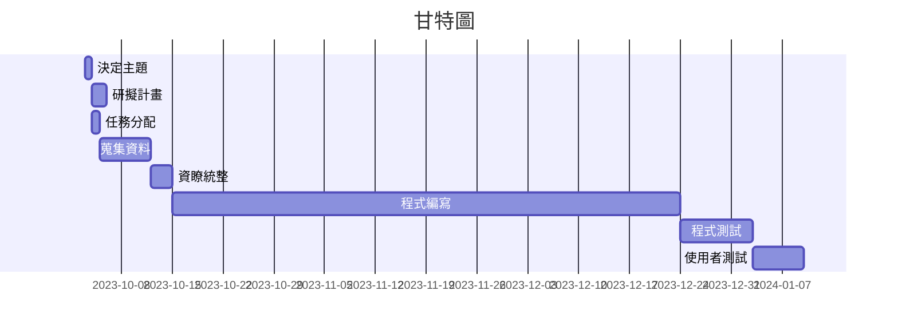

## 第六組分工表
|  *編號*  |  *任務內容*  |  *所需時(天)*  |  *前置任務*  |  *負責人*  |
| :------: |   :------:  |   :------:    |   :------:  |  :------:  |
|     1    |   決定主題   |       1       |      /      |張絜雅、康悅菱、李宜珃、夏嘉敏|
|     2    |   研擬計畫   |       2       |      1      |張絜雅、康悅菱、李宜珃、夏嘉敏|
|     3    |   任務分配   |       1       |      1      |張絜雅、康悅菱、李宜珃、夏嘉敏|
|     4    |   蒐集資料   |       7       |      3      |張絜雅、康悅菱、李宜珃、夏嘉敏|
|     5    |   資料統整   |       3       |      4      |張絜雅、康悅菱、李宜珃、夏嘉敏|
|     6    |   程式編寫   |       70      |      5      |張絜雅、康悅菱、李宜珃、夏嘉敏|
|     7    |   程式測試   |       10      |      6      |張絜雅、康悅菱、李宜珃、夏嘉敏|
|     8    |  使用者測試  |       7       |      7      |張絜雅、康悅菱、李宜珃、夏嘉敏|
---
## 甘特圖

---
## PERT/CPM圖 

